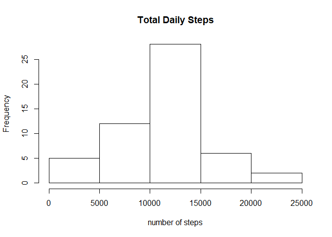
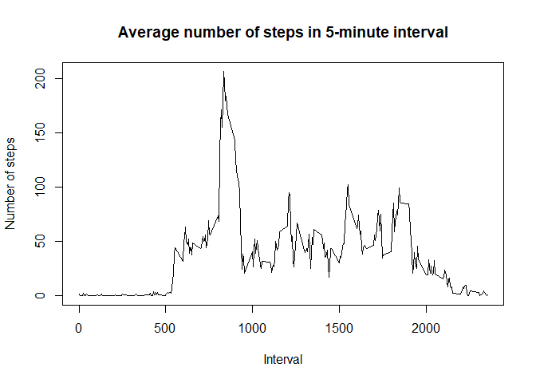
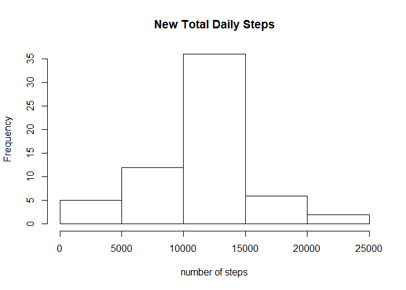
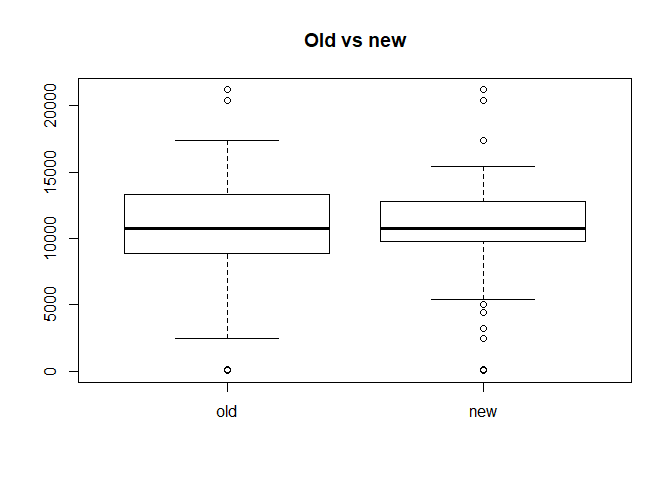
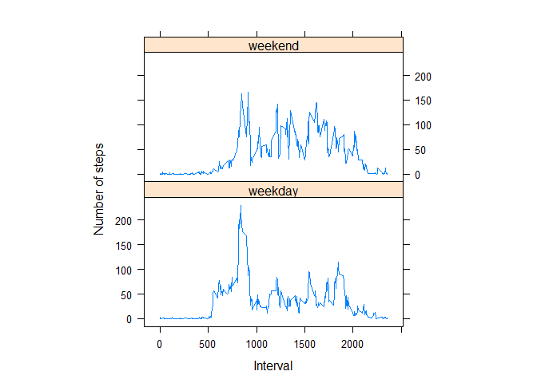

## Loading and preprocessing the data

1. Load the data (i.e. read.csv())

- Download data

```r
download.file("https://d396qusza40orc.cloudfront.net/repdata%2Fdata%2Factivity.zip", destfile="DS5w2data.zip")
```

- unzip it

```r
unzip ("DS5w2data.zip")
```

- load data


```r
activity <- read.csv("activity.csv")
```

2. Process/transform the data (if necessary) into a format suitable for your analysis

```r
activity$date<-as.Date(activity$date)
```


## What is mean total number of steps taken per day?
1. Make a histogram of the total number of steps taken each day
- Total daily steps

```r
TotalDailySteps <- aggregate(steps ~ date,activity,sum)
```

- Histogram Total daily steps

```r
hist(TotalDailySteps$steps,main="Total Daily Steps",ylab="Frequency",xlab="number of steps")
```

<!-- -->

2. Calculate and report the mean and median total number of steps taken per day
- mean total number of steps taken per day

```r
mean(TotalDailySteps$steps)
```

```
## [1] 10766.19
```
- median total number of steps taken per day

```r
median(TotalDailySteps$steps)
```

```
## [1] 10765
```


## What is the average daily activity pattern?
1. Make a time series plot (i.e. type = "l") of the 5-minute interval (x-axis) and the average number of steps taken, averaged across all days (y-axis)

- check the min and max of the 5 min interval

```r
summary(activity$interval)
```

```
##    Min. 1st Qu.  Median    Mean 3rd Qu.    Max. 
##     0.0   588.8  1177.5  1177.5  1766.2  2355.0
```

- aggregate based on the average steps per interval

```r
AveSteps5min <- aggregate(steps ~ interval,activity,mean)
```

- Plot Average number of steps in 5-minute interval

```r
plot(AveSteps5min$interval,AveSteps5min$steps, type = 'l',main="Average number of steps in 5-minute interval",ylab="Number of steps",xlab="Interval")
```

<!-- -->

2. Which 5-minute interval, on average across all the days in the dataset, contains the maximum number of steps?

- 5-minute interval contains the maximum number of steps

```r
AveSteps5min[which.max(AveSteps5min$steps),1]
```

```
## [1] 835
```

## Imputing missing values
1. Calculate and report the total number of missing values in the dataset (i.e. the total number of rows with NAs)

- The total number of missing values in the dataset

```r
sum(is.na(activity))
```

```
## [1] 2304
```

2. Devise a strategy for filling in all of the missing values in the dataset. The strategy does not need to be sophisticated. For example, you could use the mean/median for that day, or the mean for that 5-minute interval, etc.

- The mean for that 5-minute interval will be use for filling the missing data

3. Create a new dataset that is equal to the original dataset but with the missing data filled in.


```r
newactivity <- merge(x = activity, y = AveSteps5min, by = "interval", all.x = TRUE)
```

fill the missing values 

```r
newactivity$steps.x[is.na(newactivity$steps.x)] = newactivity[is.na(newactivity$steps.x),]$steps.y
```
4. Make a histogram of the total number of steps taken each day and Calculate and report the mean and median total number of steps taken per day. 
- New Total daily steps

```r
newTotalDailySteps <- aggregate(steps.x ~ date,newactivity,sum)
```

- Histogram new Total daily steps

```r
hist(newTotalDailySteps$steps.x,main="New Total Daily Steps",ylab="Frequency",xlab="number of steps")
```

<!-- -->

#### Do these values differ from the estimates from the first part of the assignment? 

As expected, the mean does not change.
The reason is that in the original data, there are some days with steps values NA for any interval. After replacing missing steps values with the mean steps of associated interval value, the mean of each step will not change.

- mean total number of steps taken per day


```r
mean(newTotalDailySteps$steps.x)
```

```
## [1] 10766.19
```
- median new total number of steps taken per day changes a bit


```r
median(newTotalDailySteps$steps.x)
```

```
## [1] 10766.19
```

#### What is the impact of imputing missing data on the estimates of the total daily number of steps?

The impact can be seen in the boxplot below:


```r
boxplot(TotalDailySteps$steps,newTotalDailySteps$steps.x,main="Old vs new",names = c("old","new")) 
```

<!-- -->


## Are there differences in activity patterns between weekdays and weekends?

1. Create a new factor variable in the dataset with two levels -- "weekday" and "weekend" indicating whether a given date is a weekday or weekend day.


```r
newactivity$day_type = weekdays(newactivity$date)
newactivity[newactivity$day_type %in% c("Saturday","Sunday"),]$day_type <- "weekend"
newactivity[newactivity$day_type %in% c("Monday","Tuesday","Wednesday","Thursday","Friday"),]$day_type <- "weekday"
newactivity$day_type <- as.factor(newactivity$day_type)
head(newactivity$day_type)
```

```
## [1] weekday weekday weekend weekday weekend weekday
## Levels: weekday weekend
```

2. Make a panel plot containing a time series plot (i.e. type = "l") of the 5-minute interval (x-axis) and the average number of steps taken, averaged across all weekday days or weekend days (y-axis). 


```r
newAveSteps5min= aggregate(steps.x ~ interval + day_type, newactivity, mean)
library(lattice)
xyplot(steps.x ~ interval | factor(day_type), data = newAveSteps5min, aspect = 1/2, 
    type = "l", ylab="Number of steps", xlab="Interval")
```

<!-- -->


